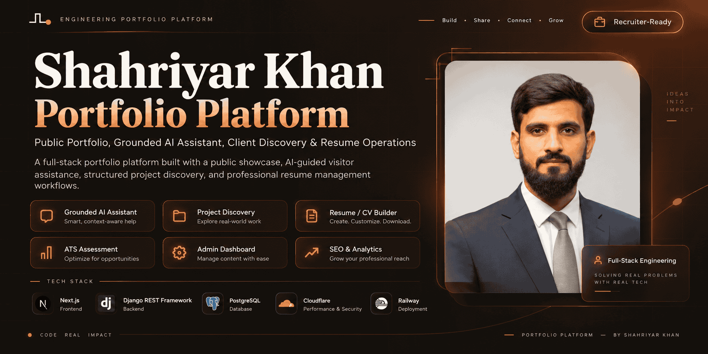

  

# Shahriyar Khan — Full-Stack Software Engineering Portfolio

### Professional presence · engineering case studies · client discovery · grounded AI assistant · CV management

**Next.js 16 · React 19 · Django REST Framework · PostgreSQL · Cloudflare Workers · Railway**

[Live Portfolio](https://shahriyarkhan.com/) ·
[GitHub](https://github.com/Shahriyar-Kh) ·
[LinkedIn](https://www.linkedin.com/in/shahriyar-kh/)

---

## Overview

This repository contains the application behind **shahriyarkhan.com**.

It is a full-stack professional platform rather than a static portfolio. Public
content is organized around a recruiter-first software-engineering identity:

**Software Engineer · Backend Engineer · Python & Django Developer · Backend-heavy Full-Stack Product Engineering**

The platform combines:

1. **Professional profile and evidence** — projects, skills, experience, education, services and case studies.
2. **Client discovery** — contact and structured project-requirement workflows.
3. **Grounded portfolio assistant** — answers from published portfolio evidence rather than unrestricted model knowledge.
4. **Private CV management** — controlled résumé/CV versioning and PDF/DOCX document export.
5. **SEO and content operations** — dynamic metadata, JSON-LD, sitemap/robots, publication controls and administration.

---

## Architecture

~~~mermaid
flowchart LR
    V[Visitor] --> WEB[Next.js 16 / React 19]
    WEB -->|REST| API[Django / DRF]

    API --> PORT[Portfolio Content]
    API --> SEO[SEO Configuration]
    API --> INQ[Contact & Project Discovery]
    API --> ASSIST[Grounded Assistant]
    API --> CV[Private CV Management]
    API --> ANALYTICS[Portfolio Analytics]

    PORT --> DB[(PostgreSQL)]
    SEO --> DB
    INQ --> DB
    ASSIST --> DB
    CV --> DB
    ANALYTICS --> DB

    ASSIST --> AI[Optional AI Provider]
    CV --> PDF[PDF Export]
    CV --> DOCX[DOCX Export]

    WEB --> CF[Cloudflare Workers]
    API --> RW[Railway]
~~~

The public presentation layer is backed by structured Django data so identity,
experience, projects, services and skills can stay aligned across the site.

---

## Public Engineering Positioning

The portfolio centers on evidence-backed work with:

- **Python**
- **Django**
- **Django REST Framework**
- **FastAPI**
- **REST APIs**
- **PostgreSQL**
- **Redis / Celery**
- **JWT / RBAC**
- **React / Next.js**
- **TypeScript**
- **Docker**
- **pytest / automated testing**
- **CI/CD**
- **OpenAPI**
- **AI integrations where they support a real product workflow**

No arbitrary proficiency percentages or fabricated scale metrics are required
to make those skills visible: the site connects capability to actual project
evidence.

---

## Canonical Project Portfolio

Current public project records are synchronized around verified repositories,
live products, or sanitized public case studies.

### Nurses Beyond Borders — NCLEX Learning & Exam Preparation Platform
Private client project delivered through TriCore Digital Tech. Public evidence
is intentionally limited to a sanitized engineering case study covering
Django/DRF, Next.js, PostgreSQL, Redis/Celery, assessment workflows,
entitlements, analytics, testing, CI and deployment preparation.

[Public engineering case study](https://github.com/Shahriyar-Kh/Shahriyar-Kh/blob/main/case-studies/nbb-lms.md)

### Yango Wing Fleet
Driver registration and fleet-operations platform with public onboarding,
staff-protected APIs, administration, analytics, filtering and CSV exports.

[Repository](https://github.com/Shahriyar-Kh/yango-wing-fleet) ·
[Live](https://yango-wing-fleet.vercel.app/)

### NoteAssist AI
AI-assisted learning and productivity platform with structured notes,
background processing, quotas, exports, Google integrations and administration.

[Repository](https://github.com/Shahriyar-Kh/noteassist_ai) ·
[Live](https://noteassistai.vercel.app/)

### FeelWise
Multi-service emotion-analysis platform using a Node.js/Express gateway and
specialized FastAPI services for text, facial-expression, speech and journal
workflows.

[Repository](https://github.com/Shahriyar-Kh/feelwise-emotion-detection) ·
[Live](https://feelwise-emotion-detection.feelwise.workers.dev/)

### SK LearnTrack
Learning/course-management platform with structured course progression,
student progress, quizzes, notes, roadmaps, analytics and current Groq-assisted
learning workflows.

[Repository](https://github.com/Shahriyar-Kh/SK_LearnTrack) ·
[Live](https://sk-learntrack.vercel.app/)

### TechBuilt Open School — current platform
A next-generation multilingual education-platform foundation in Phase 1 active
development. The public repository is an engineering showcase; the current
canonical source remains private during active product development.

[Public engineering showcase](https://github.com/Shahriyar-Kh/TechBuilt_OS)

### TechBuilt Open School — legacy/FYP LMS
The first-generation academic LMS remains separate from the current
organizational rebuild.

[Legacy/FYP repository](https://github.com/Shahriyar-Kh/TBOS)

---

## Grounded Portfolio Assistant

The visitor-facing assistant is designed around a strict public-evidence
boundary.

~~~text
Published portfolio data
        ↓
Evidence bundle
        ↓
Intent + relevance selection
        ↓
Optional AI provider
        ↓
Structured-response validation
        ↓
Visitor answer grounded in public sources
~~~

Public assistant context can include:

- projects
- skills
- services
- experience
- education
- public professional profile

It excludes private inquiry data, account data, unpublished client material and
private CV-management records.

---

## Client Project Discovery

Prospective clients can submit structured project context instead of only a
free-text message. The workflow can capture:

- organization
- project type
- business problem
- required features
- timeline
- budget context
- technical constraints
- additional notes

The persisted business record remains based on visitor-approved structured
input.

---

## Private CV Management

The administration side contains a dedicated CV-management domain with
versioned source facts and controlled document generation.

Publicly relevant capabilities include:

- canonical CV source facts
- versioned CV records
- approved document lifecycle
- PDF export
- DOCX export
- export validation
- document integrity checks

Internal assessment or job-matching implementation details are intentionally
not presented as public product features.

---

## Administration & Content Operations

The Django administration layer manages the data behind the portfolio,
including:

- projects
- skills
- services
- experience
- education
- site configuration
- SEO data
- analytics
- inquiries / project requests
- CV versions and document exports

This makes the portfolio a maintained content/operations system instead of a
collection of hardcoded landing-page strings.

---

## SEO Engineering

SEO is implemented as application functionality.

The codebase includes:

- route-specific metadata
- canonical URLs
- OpenGraph metadata
- structured JSON-LD
- sitemap generation
- robots configuration
- project/service metadata
- publication-state controls
- meaningful image alt text
- content-integrity tests

The SEO strategy prioritizes consistent identity and technically useful content
over keyword stuffing or thin location pages.

---

## Privacy & Content Integrity

Public content deliberately avoids:

- fabricated user, revenue, traffic or performance metrics
- fake testimonials or ratings
- unsupported certifications
- client-private source code
- credentials or environment values
- learner/customer data
- private infrastructure details
- unpublished client requirements
- internal CV-management data that is not part of the public product

The Nurses Beyond Borders project uses a sanitized public case study rather
than exposing the private client repository.

---

## Testing & CI

### Backend

~~~text
Django system check
→ migration consistency check
→ complete Django test suite
~~~

### Frontend

~~~text
npm ci
→ TypeScript
→ ESLint
→ Vitest
→ production build
→ dependency audit
~~~

The frontend test surface includes accessibility, routes/views, assistant UI,
project discovery, metadata/JSON-LD, sitemap, motion/reduced-motion,
content-integrity and privacy-oriented regression guards.

The backend includes tests around public APIs, assistant grounding, inquiries,
CV/document workflows, SEO/site configuration and deployment safety.

---

## Production Stack

| Layer | Technology |
|---|---|
| Frontend | Next.js 16 / React 19 |
| Frontend hosting | Cloudflare Workers |
| Backend | Django / Django REST Framework |
| Backend hosting | Railway |
| Database | PostgreSQL |
| Styling | Tailwind CSS 4 |
| Motion | GSAP / ScrollTrigger |
| AI | Evidence-grounded optional provider integration |
| Documents | ReportLab / python-docx / pypdf |

Live site: **https://shahriyarkhan.com/**

---

## Repository Structure

~~~text
shahriyarkhan-portfolio-v1/
├── web/
│   ├── src/app/
│   ├── src/components/
│   ├── src/content/
│   ├── src/lib/
│   └── src/test-guards/
├── backend/
│   ├── apps/
│   │   ├── portfolio/
│   │   ├── assistant/
│   │   ├── inquiries/
│   │   ├── resume_builder/
│   │   ├── seo/
│   │   ├── analytics_app/
│   │   └── site_config/
│   ├── scripts/
│   └── requirements/
├── docs/rebuild/
├── PROVENANCE.md
└── .github/workflows/ci.yml
~~~

---

## Local Development

### Frontend

~~~bash
cd web
nvm use
npm ci
cp .env.example .env.local
npm run dev
~~~

### Backend

~~~bash
cd backend
python -m venv .venv
pip install -r requirements/dev.txt
python manage.py migrate
python manage.py runserver
~~~

---

## Engineering Review Entry Points

- `backend/apps/portfolio/` — canonical portfolio records
- `backend/apps/assistant/` — grounded public assistant
- `backend/apps/inquiries/` — contact/project-discovery workflows
- `backend/apps/resume_builder/` — private CV-management domain
- `backend/apps/seo/` — SEO data/configuration
- `web/src/content/case-studies/` — evidence-backed case-study registers
- `web/src/lib/json-ld.ts` — structured data
- `web/src/test-guards/` — content/release-integrity checks
- `.github/workflows/ci.yml` — repository quality gate

---

## Author

**Shahriyar Khan**  
Software Engineer · Backend Engineer · Python & Django Developer

**Core focus:** Python · Django · Django REST Framework · FastAPI · PostgreSQL · Redis/Celery · React/Next.js · REST APIs

- GitHub: [@Shahriyar-Kh](https://github.com/Shahriyar-Kh)
- Portfolio: [shahriyarkhan.com](https://shahriyarkhan.com/)
- LinkedIn: [Shahriyar Khan](https://www.linkedin.com/in/shahriyar-kh/)

---

**Backend engineering · full-stack product delivery · evidence-backed portfolio content**

